# APT Casino - Monad Testnet

A decentralized casino platform built on Monad Testnet with Pyth Entropy for provably fair gaming and MetaMask Smart Accounts integration.

> **Hackathon Submission**: This project is being submitted for the "Best consumer application" track of the MetaMask Smart Accounts x Monad Dev Cook-Off hackathon.

## 🎮 The Story Behind APT Casino

A few days ago, I was exploring transactions on Etherscan when I saw an advertisement for a popular centralized casino platform offering a 200% bonus on first deposits. I deposited 120 USDT and received 360 USDT in total balance in their custodial wallet.

When I started playing, I discovered I could only bet $1 per game and couldn't increase the amount. After contacting customer support, I learned I had been trapped by hidden "wager limits" tied to the bonus scheme. To withdraw my original deposit, I would need to play $12,300 worth of games!

In a desperate attempt to recover my funds, I played different games all night—roulette, mines, spin wheel—and lost everything.

This frustrating experience inspired APT Casino: a combination of GameFi, AI, and DeFi where users can enjoy casino games in a safe, secure, and transparent environment that doesn't scam its users.

## 🎯 The Problem

The traditional online gambling industry suffers from several issues:

- **Unfair Game Outcomes**: Many platforms manipulate results for unfair play
- **High Fees**: Exorbitant charges for deposits, withdrawals, and gameplay
- **Restrictive Withdrawal Policies**: Conditions that prevent users from accessing their funds
- **Misleading Bonus Schemes**: Trapping users with unrealistic wagering requirements
- **Lack of True Asset Ownership**: Centralized control over user funds

## 💡 Our Solution

APT Casino addresses these problems by offering:

- **Provably Fair Gaming**: Powered by Pyth Entropy on Arbitrum Sepolia
- **Multiple Games**: Wheel, Roulette, Plinko, and Mines with verifiable outcomes
- **MetaMask Smart Accounts**: Enhanced wallet experience with batch transactions
- **MON Token**: Native currency for Monad Testnet
- **Flexible Withdrawal**: Unrestricted access to funds
- **Transparent Bonuses**: Clear terms without hidden traps
- **True Asset Ownership**: Decentralized asset management

## 🌟 Key Features

### 1. Smart Account Integration

- **Batch Transactions**: Multiple bets in one transaction
- **Delegated Gaming**: Authorize strategies to play on your behalf
- **Lower Gas Costs**: Optimized for frequent players
- **Enhanced Security**: Smart contract-based accounts

### 2. Provably Fair Gaming

- **Pyth Entropy**: Cryptographically secure randomness
- **On-Chain Verification**: All game outcomes verifiable
- **Transparent Mechanics**: Open-source game logic

### 3. Multi-Chain Architecture

- **Gaming Network**: Monad Testnet (Chain ID: 10143)
- **Entropy Network**: Arbitrum Sepolia (Chain ID: 421614)

### 4. Game Selection

- **Roulette**: European roulette with Smart Account batch betting
- **Mines**: Strategic mine-sweeping with delegated pattern betting
- **Plinko**: Physics-based ball drop with auto-betting features
- **Wheel**: Classic spinning wheel with multiple risk levels

## 🚀 Getting Started

1. **Connect Wallet**: Connect your MetaMask wallet to Monad Testnet
2. **Get Tokens**: Get MON tokens from the Monad testnet faucet
3. **Deposit**: Deposit MON to your house balance
4. **Play**: Start playing provably fair games!

### Network Configuration

Add Monad Testnet to MetaMask:
- **Network Name**: Monad Testnet
- **RPC URL**: `https://testnet-rpc.monad.xyz`
- **Chain ID**: `10143`
- **Currency Symbol**: `MON`
- **Block Explorer**: `https://testnet.monadexplorer.com`

## 🔷 Smart Account Features

APT Casino leverages MetaMask Smart Accounts for an enhanced gaming experience:

### Delegation Benefits:
- **Auto-Betting Strategies**: Delegate betting permissions to strategy contracts
- **Batch Gaming Sessions**: Play multiple games in a single transaction
- **Session-Based Gaming**: Set time-limited permissions for continuous play
- **Gasless Gaming**: Sponsored transactions for smoother experience

### Usage:
```javascript
// Create a delegation for auto-betting
const createAutoBetDelegation = async (maxBet, timeLimit, gameTypes) => {
  return delegationRegistry.createDelegation({
    delegatee: strategyContract,
    constraints: {
      maxAmount: maxBet,
      validUntil: timeLimit,
      allowedGames: gameTypes
    }
  });
};

// Execute batch bets through delegation
const executeBatchBets = async (bets) => {
  return delegationRegistry.executeDelegatedTransactions({
    delegationId,
    transactions: bets.map(bet => ({
      to: bet.gameContract,
      data: bet.data,
      value: bet.amount
    }))
  });
};
```

## 🏗 System Architecture Overview

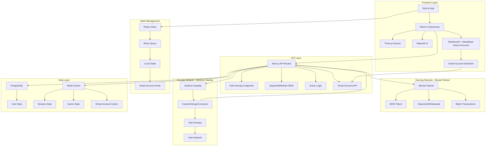

## 🔗 Wallet Connection & Smart Account Flow

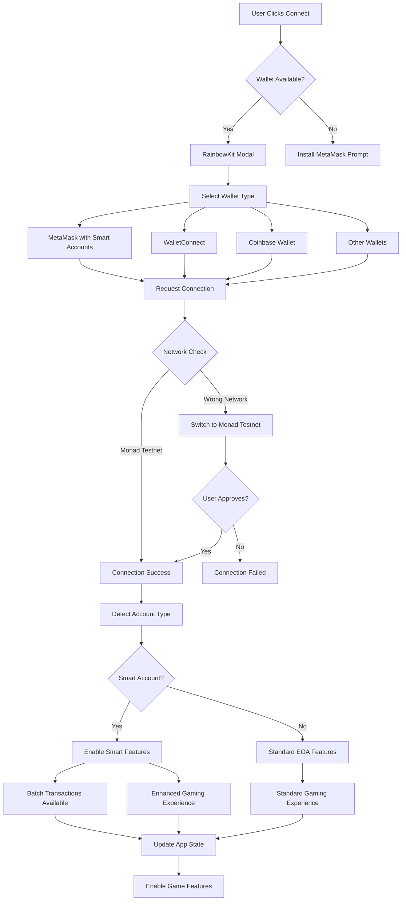

## 🔷 Smart Account Detection & Features

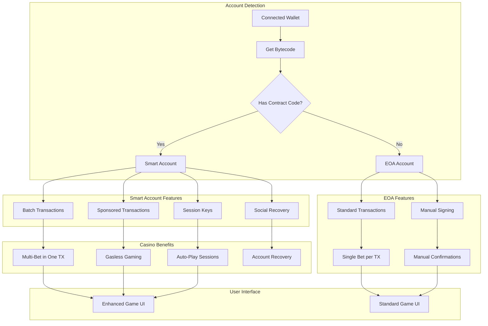

## 🌐 Multi-Network Architecture (Monad + Arbitrum)

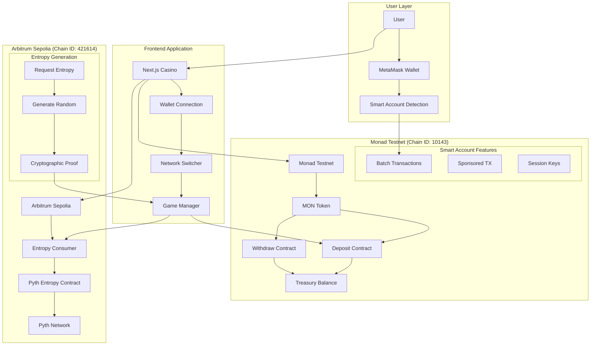

## 🎲 Pyth Entropy Integration Architecture

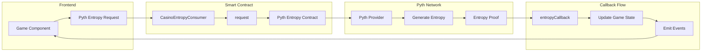

## 🎮 Game Execution Flow (Smart Account Enhanced)

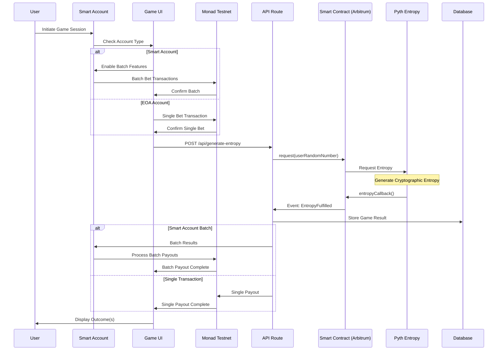

## 🎯 Smart Account Gaming Benefits

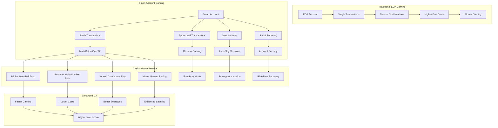

## 🔄 Smart Account Transaction Flow

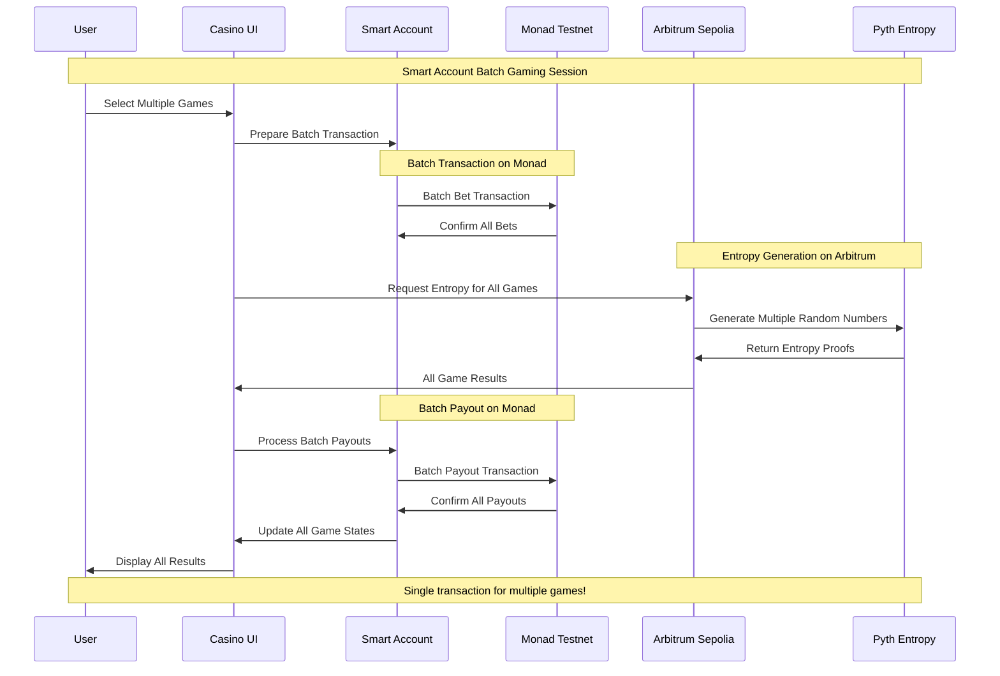

## 📊 Performance Comparison: EOA vs Smart Account

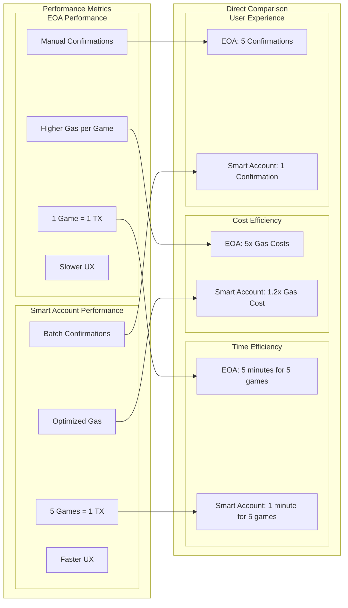

## 🎯 Game-Specific Flows

### Mines Game Flow
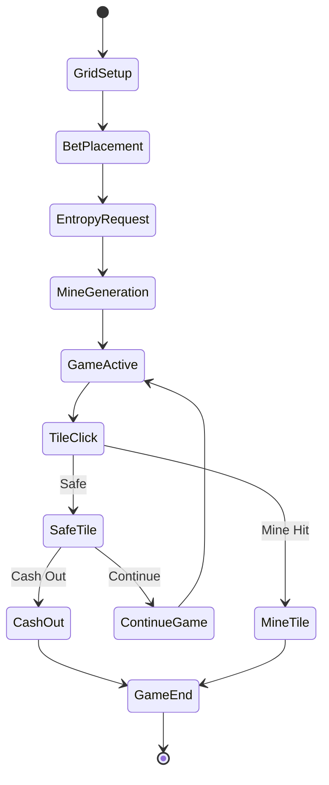

### Plinko Game Flow
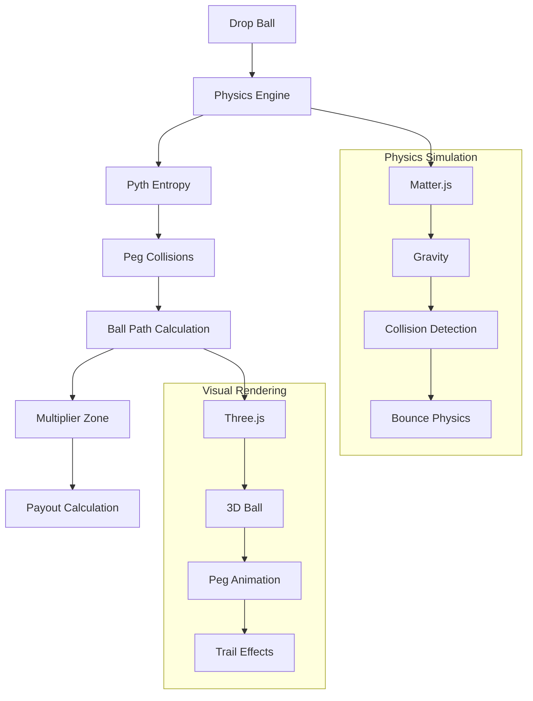

### Roulette Game Flow
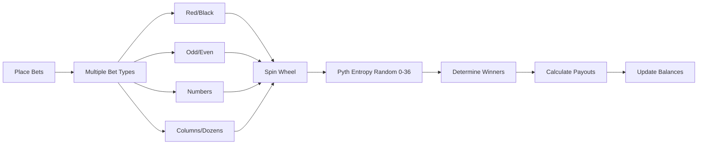

## 🔮 Future Roadmap

- **Mainnet Launch**: Deploying on mainnet for real-world use
- **Additional Games**: Expanding the game selection
- **Enhanced DeFi Features**: Staking, farming, yield strategies
- **Gasless Transactions**: Improving user convenience
- **Developer Platform**: Allowing third-party game development
- **Live Streaming**: In-app gameplay streaming
- **Expanded Smart Account Features**: More delegation options
- **Provably Fair**: All randomness verified on-chain via Pyth Entropy
- **Non-custodial**: Users maintain full control of their funds
- **Transparent**: All game logic and outcomes are verifiable

## 🔗 Links

- **Live Demo**: [https://apt-casino-monad.vercel.app](https://apt-casino-monad.vercel.app)